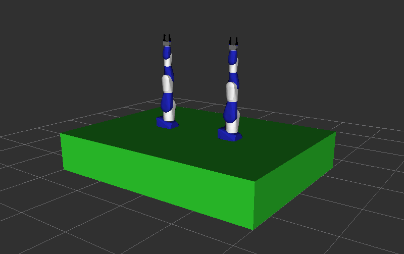

# Dual-Arm Robotic Pick-and-Place System: A ROS-Based Implementation

[Download Simulation Video](DemoVideos/video.mkv)
<p align="center">
  <video width="70%" controls>
    <source src="DemoVideos/video.mp4" type="video/mp4">
    Your browser does not support the video tag.
  </video>
</p>
<p align="center">
  
</p>

## Table of Contents
1. [Introduction](#introduction)
2. [Prerequisites](#prerequisites)
3. [Setup Details](#setup-details)
    - [Step 1: Create Workspace](#step-1-create-workspace)
    - [Step 2: Download and Configure Motoman Robot](#step-2-download-and-configure-motoman-robot)
    - [Step 3: Create Project Packages](#step-3-create-project-packages)
    - [Step 4: Launch and Test the System](#step-4-launch-and-test-the-system)
4. [System Architecture](#system-architecture)
    - [Scene Spawner Node](#scene-spawner-node)
    - [Random Pose Generator Node](#random-pose-generator-node)
    - [Motion Control Node](#motion-control-node)
5. [Execution Workflow](#execution-workflow)
    - [Motion Planning](#motion-planning)
    - [Object Manipulation](#object-manipulation)
    - [Feedback and Monitoring](#feedback-and-monitoring)
6. [Unified Launch File](#unified-launch-file)
7. [ROS Action for Pick-and-Place](#ros-action-for-pick-and-place)


## Introduction
The dual-arm pick-and-place application represents a practical implementation of advanced robotic concepts, leveraging the Robot Operating System (ROS) to coordinate motion and object manipulation. The primary objective of this work was to design and implement a system where two robotic arms collaborate to perform pick-and-place tasks involving two boxes spawned at random positions. This task required the integration of multiple ROS nodes to ensure seamless operation, including scene setup, pose generation, motion control, and action feedback mechanisms.

Besides the general motoman package, the application includes four packages:
- **my_sia20d**: Contains URDF and XACRO configurations for the dual-arm setup consisting of two SIA20D robots and gripper defined in wsg50_gripper.
- **wsg50_gripper**: Contains URDF and configurations for the grippers attached to the robotic arms.
- **my_moveit2**: Contains SRDF file with the definition of Moveit motion groups for the dual-arm robot with grippers. It includes definitions of common poses like home position, closed and open gripper, and other configuration and controller files.
- **motion_test_pkg**: Contains the functionality related to the pick-and-place action specified in the assignment.

Package (motion_test_pkg) includes three nodes responsible for (i) adding boxes to the scene – large box for green table, “base box” and “top box” at random coordinates; attaching “top box” to the robot links, (ii) planning and implementing robot motion, (iii) generating random coordinates of “top box” and “base box ”. Communication between these nodes is implemented using three Services. Communication between user and system is implemented using ROS action which allows setting goals and monitoring the system's progress in real-time.

## Prerequisites

Before setting up and running the dual-arm pick-and-place system, ensure you have the following prerequisites:

1. **Operating System**: Ubuntu 20.04 LTS (or compatible Linux distribution)
2. **ROS Distribution**: ROS Noetic Ninjemys
3. **Python**: Python 3.8
4. **Dependencies**:
    - `catkin` build system
    - `rosdep` for dependency management
    - `MoveIt` for motion planning
    - `actionlib` for ROS actions
    - `tf` for coordinate transformations
5. **Hardware**:
    - Two SIA20D robotic arms (simulated or real)
    - WSG50 grippers (simulated or real)
6. **Software Packages**:
    - `motoman` package from ROS-Industrial
    - Custom packages (see below)

### Installation of ROS Noetic
Follow the official ROS Noetic installation guide: [ROS Noetic Installation](http://wiki.ros.org/noetic/Installation/Ubuntu)

### Installation of MoveIt
Install MoveIt for ROS Noetic:
```bash
sudo apt-get update
sudo apt-get install ros-noetic-moveit
```

### Setting Up the Workspace
Ensure you have a catkin workspace set up:
```bash
mkdir -p ~/catkin_ws/src
cd ~/catkin_ws/
catkin_make
source devel/setup.bash
```
### Cloning the Required Repositories
Clone the necessary repositories into your workspace:
```bash
cd ~/catkin_ws/src
git clone -b kinetic-devel https://github.com/ros-industrial/motoman.git
```

### Installing Dependencies
Use `rosdep` to install all dependencies:
```bash
cd ~/catkin_ws
rosdep update
rosdep install --from-paths src/ --ignore-src --rosdistro noetic
```


## Setup Details
The implementation of the dual-arm pick-and-place application involved multiple steps, beginning with the workspace setup and package creation and culminating in the execution of the system components. Below is a detailed description of each step:

### Step 1: Create Workspace
To organize the project, a dedicated workspace named `assignment_ws` was created:
```bash
mkdir assignment_ws
cd assignment_ws
```
This workspace served as the root directory for all packages and configurations used in the project.

### Step 2: Download and Configure Motoman Robot
The Motoman robot package was downloaded and configured to set up the robotic arms:
```bash
git clone -b kinetic-devel https://github.com/ros-industrial/motoman.git src/motoman
rosdep update
rosdep install --from-paths src/ --ignore-src --rosdistro noetic
```

### Step 3: Create Project Packages
Copy project packages from the submitted zip file, that is folders `motion_test_pkg`, `my_moveit2`, `my_sia20d`, `wsg50_gripper` to the same `/src` folder where the motoman package installed on the previous step is located. Then run:
```bash
chmod +x src/motion_test_pkg/src/*.py
catkin_make
source devel/setup.bash
```

### Step 4: Launch and Test the System
After setting up the workspace and configuring the nodes, the system was tested using multiple ROS commands. These steps involved:

1. **Launching the Combined System**:
    ```bash
    roslaunch motion_test_pkg combined_action.launch
    ```
    This command started the scene spawner, random pose generator, and motion control nodes, as well as the visualization environment.

2. **Sending a Pick-and-Place Command**:
    A goal (string “start”) is sent to the motion control action server `/process_action` without using a client, just directly publishing the following message to the topic `/process_action/goal`:
    ```bash
    rostopic pub /process_action/goal motion_test_pkg/MoveRobotActionGoal "header:
      seq: 0
      stamp:
        secs: 0
        nsecs: 0
      frame_id: ''
    goal_id:
      stamp:
        secs: 0
        nsecs: 0
      id: ''
    goal:
      command: 'start'"
    ```

3. **Monitoring Feedback**:
    The feedback from the pick-and-place action was monitored using the topic `/process_action/feedback`:
    ```bash
    rostopic echo /process_action/feedback
    ```

4. **Checking Results**:
    The results of the pick-and-place operation were validated by reading messages in the topic `/process_action/result`:
    ```bash
    rostopic echo /process_action/result
    ```

## System Architecture
<p align="center">
  
</p>
The dual-arm pick-and-place application was developed using a modular architecture, comprising several interconnected ROS nodes. Each node performed a specific function to ensure the system's overall efficiency and functionality. The application consists of the following key components:

### Scene Spawner Node
The scene spawner node (`/scene_interface`) was provided as part of the assignment package and formed the foundation of the system. This node interacts with MoveIt Planning Scene Interface to manage objects in the robot's environment. It clears pre-existing objects in the scene and adds a "table" object to serve as a base reference. It also provides two server interfaces to interact with the motion control node (`/motion_control`) through Services:
- `/scene_spawner/spawn_box`: Accepts requests to add boxes to the scene at specific positions and dimensions.
- `/scene_spawner/attach_release_box`: Allows attaching or releasing objects from the robot's end effectors.

Message types for these services are `motion_test_pkg/BoxSpawner` and `motion_test_pkg/BoxAttach`, respectively defined in the corresponding .srv files in the `/srv` folder.

### Random Pose Generator Node
This node (`/random_pose_generator`) has been developed by us to generate random X, Y coordinates upon request from the `/motion_control` node.
1. **Functionality**:
    - The node generates random (x, y) coordinates within specified boundaries (X_MIN, X_MAX, Y_MIN, Y_MAX) and sets a fixed z value (Z_HEIGHT = 0.7), representing the height of a table.
    - The pose is returned to the client as a service response.
2. **Service**:
    - Service Name: `/random_pose_generator`
    - Service Type: `RandomPose` (imported from `motion_test_pkg.srv`)
    - Request: No fields in the request are explicitly used; it only triggers the random pose generation.
    - Response: Contains three fields: x, y, and z (the generated pose coordinates).
3. **Core Functions**:
    - `handle_random_pose_request(req)`: Handles service requests by generating random (x, y) values within the defined workspace boundaries and setting z to a constant height. Logs the generated pose and returns it as a response using the `RandomPoseResponse` message.

The algorithm for checking that box coordinates are reachable by the robot and there are no collisions between boxes is implemented on the client side in the `/motion_control` node. In case the coordinates are not reachable or overlap with other objects, the request to the random_pose_generator node is repeated.

### Motion Control Node
This node (`/motion_control`) was developed by us. It acts as the central decision-making component of the system. It utilizes the MoveIt framework for planning and executing trajectories to handle objects in a coordinated manner. In order to provide the action interface with an external user, this node is realized as a class `MoveRobotServer` with an action server instance as an attribute:
```
self.server = actionlib.SimpleActionServer('/process_action', MoveRobotAction, self.execute, False)
```

## Execution Workflow
The node waits for services `/scene_spawner/spawn_box` and `/scene_spawner/attach_release_box` for object spawning and manipulation and service `/random_pose_generator` to generate random x,y coordinates for the base and top box objects. After the random coordinates are received, the boxes are spawned and the robot arm1 or arm2 can reach them. This check is done in the class member function `execute()` by trying to build a motion plan, such as:
```python
arm2.set_pose_target(pose_stamped_target_offset_wrist_base)
success, plan_arm2, _, _ = arm2.plan()
```
In case the box object cannot be reached, that is if `success = False`, new coordinates are generated and the process repeats until `success = True`. This ensures that boxes are within the robot workspace and that they don’t collide with robot parts. A separate check is done to ensure that the “base box” and “top box” do not overlap.

The robotic arm to handle the operation with the top box is assigned dynamically based on the position of the “base box” and “top box” relative to the base links of robot 1 and robot 2. Coordinates of base links are found using `tf.listener` realized in the static method of the class:
```python
@staticmethod
def get_robot_coordinates(world_frame="world", base_link_frame="one_base_link"):
    tf_listener = tf.TransformListener()
    tf_listener.waitForTransform(world_frame, base_link_frame, rospy.Time(0), rospy.Duration(3.0))
    (trans, rot) = tf_listener.lookupTransform(world_frame, base_link_frame, rospy.Time(0))
    return trans
```

### Motion Planning
Trajectories for each arm and gripper are planned using Moveit functionality. Targets are defined using “top box” and “base box” coordinates with precise offsets for grasping, as well as several poses defined in the Moveit SRDF configuration file in the `my_moveit2` package. To calculate poses relative to the robot's world frame, we use kinematic transformations frame transformation as `object_frame_top.p = PyKDL.Vector(top_x, top_y, top_z)` and frame to pose transform function `frame_to_pose` provided in course materials.

Depending on the relative positions between boxes and robot arms, two types of motion are possible:
1. Both pick and place actions are implemented by one arm. This is realized when both boxes are closer to one of the arms.
2. Initially, the “top box” is picked by one arm but the final place of the ”top box” on the “base box” is implemented by the other arm. This is realized in case the “top box” is spawned closer to one arm and the “base box” is closer to the other one.

In case (ii), the “top box” is transferred between arms by implementing an intermediate pick and place operation in the middle point with coordinates between robot bases `transfer_x, transfer_y, transfer_z = (0, 0, 0.7)`.

### Object Manipulation
Grippers are opened and closed at appropriate stages for object grasping and releasing. Objects are attached to or detached from the robot's grippers via service calls. The top box is picked by one arm and transferred to a base position managed by the other arm. If arms need to pass the box, an intermediate transfer pose is defined and executed.

### Feedback and Monitoring
Regular feedback on status and actions are published in the action server topics `/process_action/feedback` and `/process_action/result`. In principle, it is possible to set up a client which listens to these topics, but it is not necessary for the present Assignment.

## Unified Launch File
A single launch file ([motion_test_pkg/launch/combined_action.launch](motion_test_pkg/launch/combined_action.launch)) was created to streamline the execution of the system.

This launch file:
1. Initializes MoveIt 2 for motion planning and Rviz for visualization by including the launch file of the `my_moveit2` package.
2. Launches three nodes from the `motion_test_pkg` package shown in Figure 1, that is `\scene_interface`, `\motion_control`, and `\random_pose_generator` nodes.

## ROS Action for Pick-and-Place
To manage the pick-and-place process, a ROS action was implemented. It offered the following functionalities:
- **Goal Execution**: Allowed external nodes or users to trigger the process.
- **Feedback Mechanism**: Published the status of the operation (e.g., picking, placing, transferring).
- **Result Reporting**: Communicated the successful completion or failure of the process.

This structured approach ensured modularity, enabling each node to focus on its specific task while contributing to the overall system functionality. The communication between nodes via ROS topics, services, and actions was critical in achieving a seamless workflow.


## Final Testing and Demonstration
After integrating all components, the system was tested for:
1. Robot 1 performing both pick-and-place operations.
2. Robot 2 performing both pick-and-place operations.
3. Robot 1 picking the box, with Robot 2 placing it (and vice versa).

The results were recorded in a demonstrator video, available in the recordings folder, to showcase the system's functionality.
```


### Step 1: Create Workspace
```bash
mkdir assignment_ws

cd assignment_ws
```

### Step 2: Download Motoman
```bash
git clone -b kinetic-devel https://github.com/ros-industrial/motoman.git src/motoman

rosdep update

rosdep install --from-paths src/ --ignore-src --rosdistro noetic
```

### Step 3 

Copy files from Part2, together with CMakeText and package.xmp files in folder to 
src/

```bash
chmod +x src/motion_test_pkg/src/*.py

catkin_make

source devel/setup.bash
```

### Step 4

Open several terminals and source workspace. Then implement following commands in separate terminal each

#### Starting nodes 

```bash
roslaunch motion_test_pkg combined_action.launch
```
#### Publishing a Goal Message

To publish a goal message to the `/process_action/goal` topic, use the following command:

```bash
rostopic pub /process_action/goal motion_test_pkg/MoveRobotActionGoal "header:
  seq: 0
  stamp:
    secs: 0
    nsecs: 0
  frame_id: ''
goal_id:
  stamp:
    secs: 0
    nsecs: 0
  id: ''
goal:
  command: 'start'"
```

#### Showing feedback and result messages from the action server

```bash
rostopic echo /process_action/feedback
```

```bash
rostopic echo /process_action/result
```

### Step 5

Continue to debug, understand how to make robot arm move to box


